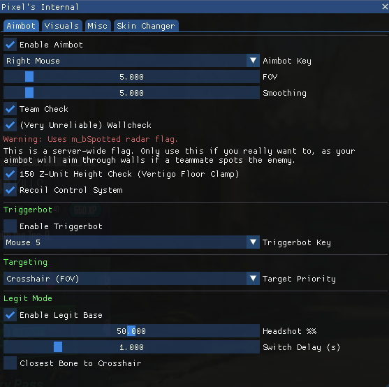
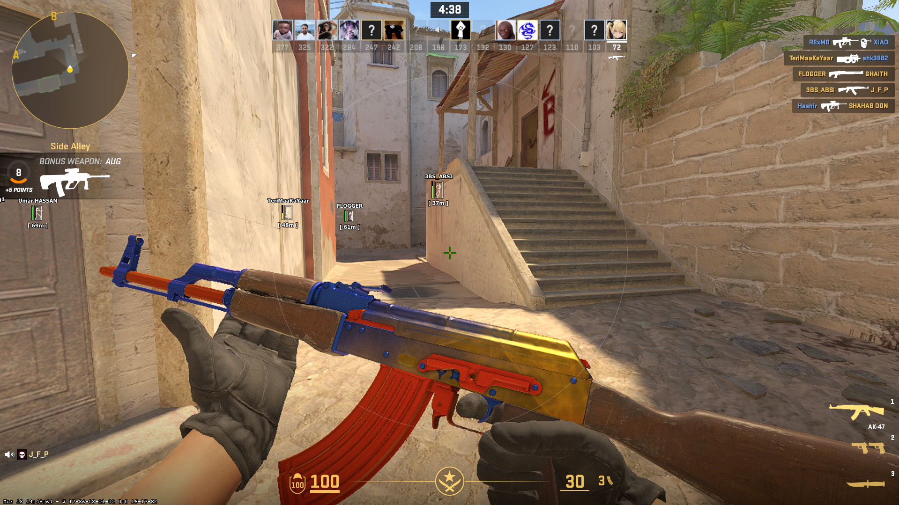
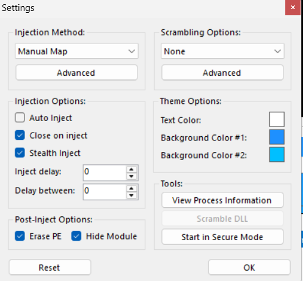

# Pixel's CS2 Internal Cheat

A powerful internal cheat for Counter-Strike 2. This repo has the full source code and everything you need to build it yourself.

This code is about **4 months old** as of re-publishing. GitHub unfairly took the original repo down, so I'm re-pushing it here.

**Before you try to build or use this, read this entire section carefully:**

- The **skin changer works** but the **knife changer does NOT work** in this release. The way I was doing it is 100% wrong - you cannot change models or apply paintkits that way. I am **not** going to update the code. I will **not** push updates to this repository. Figure it out yourself.
- The bone setup needs updating to **AnimGraph 2** (CS2's new animation system). The old bone indices used here are outdated.
- There is **no visibility check**. The way I was doing it was also wrong - you need actual ray/trace, not the spotted flag.
- All offsets and signatures in `Cs2-Offsets/` need to be updated. They will be stale by the time you read this.
- **Do NOT message me on Discord asking for help.** Figure it out yourself. If you can't update the bones, update the offsets, fix the skin changer, or implement proper trace-based visibility, you are not smart enough to be cheating on CS2. All the information you need is publicly available.

> Check me out! Be sure to visit my personal website at https://pixelis.dev/ for more projects and tools.

> [!IMPORTANT]
> **Offsets are up to date as of: 25/3/2026**

## Features

Pixel's Internal is fast and built to stay hidden. Since it's an internal cheat, it's way smoother than external ones.

### Aimbot & RCS
- **Aimbot**: Custom aim with team check and wall check.
- **Smooth Aim**: Human-like aiming so you don't look like a bot.
- **RCS**: Recoil control to keep your shots on target.
- **Triggerbot**: Shoots automatically when someone walks into your crosshair.

### Visuals (ESP)
- **Player ESP**: See boxes, skeletons, and lines for all players.
- **Extra Info**: Track health, names, and how far away enemies are.
- **World ESP**: See the bomb timer and where your bullets are hitting.
- **Anti-Flash**: Don't get blinded by flashbangs.

### Skin Changer
- **Change Skins**: Pick any skin for your guns while in-game.
- **StatTrak**: Add kill counters to your skins.
- **Note**: The knife changer does **NOT** work. See the note at the top of this README.

## Roadmap to v2

I am already working on the next major update! **Pixel CS2 Internal v2** will include:

- [ ] **Reliable Visibility Check**: No more aiming through walls. Uses `bSpottedByMask` for a truly legit experience.
- [ ] **Spectator List**: See exactly who is watching you in real-time.
- [ ] **Hit Sound**: Crunchy audio feedback for every shot landed.
- [ ] **Glow ESP**: High-performance glowing outlines for maximum visibility.
- [ ] **External Radar**: A separate map overlay for better awareness.
- [ ] **Bhop**: Automatic bunnyhopping for faster movement.

> [!TIP]
> **Pixel CS2 Internal v2** will be released to the public once this repository reaches **40 Stars**! ⭐ Help us get there!

## Staying Safe

Standard injectors like **Xenos** or **Extreme Injector** can be detected if you're not careful. 

To stay undetected with this cheat, you **must** use these settings:
1. **Stealth Inject**: Hides the cheat from basic scans.
2. **Erase PE Headers**: Wipes the cheat's footprint from memory after it loads.

### Best Settings

## Build & Setup

1. **Get Visual Studio**: Install VS 2022 with C++ desktop development.
2. **Open Project**: Open `Pixel's CS2 Internal.slnx`.
3. **Update Offsets**: Put your fresh offsets in the `Cs2-Offsets` folder.
4. **Update Bones to AnimGraph 2**: The old bone indices will not work. You need to dump the new bone structure and update `GetBonePosition` and all hardcoded bone IDs.
5. **Fix the Skin Changer**: The knife changer approach is completely wrong. You need to figure out the correct method yourself.
6. **Build**: Set to **Release | x64** and build the solution. Your DLL will be in `x64/Release/`.

## How to use

If you don't want to build it, there is a prebuilt DLL in the `releases/` folder.  
**Note:** This DLL is definitely outdated by now. Build it yourself with fresh offsets.

1. Open CS2.
2. Run your injector as Admin.
3. **Copy the config from the screenshot above** for Extreme Injector or any major injector. 
4. **Manual Map** is important! Make sure your injector is set to use it.
5. Inject and press **INSERT** for the menu.

---

> **IMPORTANT: This project is for educational use and research ONLY.** I am not responsible for any bans, VAC detections, or account losses. This code is provided AS-IS with no guarantees. Do not use this in online matches if you care about your account. This repository exists purely for learning purposes - please respect that so GitHub doesn't take it down again.

Check out more at [pixelis.dev](https://pixelis.dev/)
